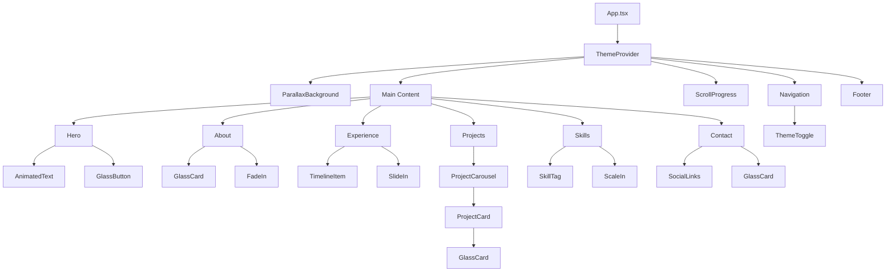

# Glassmorphism Portfolio Website - Architecture Document

## Project Overview
A modern, glassmorphism-themed portfolio website built with React, TypeScript, and Vite. Features dark mode support, elaborate animations with parallax effects, and a responsive design optimized for performance.

---

## 1. Folder Structure

```
src/
├── components/
│   ├── layout/
│   │   ├── Navigation.tsx
│   │   ├── Footer.tsx
│   │   └── ScrollProgress.tsx
│   ├── sections/
│   │   ├── Hero.tsx
│   │   ├── About.tsx
│   │   ├── Experience.tsx
│   │   ├── Projects.tsx
│   │   ├── Skills.tsx
│   │   └── Contact.tsx
│   ├── ui/
│   │   ├── GlassCard.tsx
│   │   ├── GlassButton.tsx
│   │   ├── ThemeToggle.tsx
│   │   ├── ProjectCarousel.tsx
│   │   ├── ProjectCard.tsx
│   │   ├── SkillTag.tsx
│   │   ├── TimelineItem.tsx
│   │   ├── SocialLinks.tsx
│   │   ├── ParallaxBackground.tsx
│   │   └── AnimatedText.tsx
│   └── animations/
│       ├── FadeIn.tsx
│       ├── SlideIn.tsx
│       ├── ScaleIn.tsx
│       └── ParallaxLayer.tsx
├── context/
│   └── ThemeContext.tsx
├── hooks/
│   ├── useTheme.ts
│   ├── useScrollPosition.ts
│   ├── useParallax.ts
│   ├── useIntersectionObserver.ts
│   └── useMediaQuery.ts
├── styles/
│   ├── global.css
│   ├── variables.css
│   ├── glassmorphism.css
│   ├── animations.css
│   ├── typography.css
│   ├── utilities.css
│   └── responsive.css
├── types/
│   ├── theme.types.ts
│   ├── project.types.ts
│   ├── skill.types.ts
│   └── experience.types.ts
├── data/
│   ├── projects.ts
│   ├── skills.ts
│   ├── experience.ts
│   └── social.ts
├── utils/
│   ├── theme.utils.ts
│   └── animation.utils.ts
├── App.tsx
├── main.tsx
└── vite-env.d.ts
```

---

## 2. Component Hierarchy



---

## 3. Design System Specification

### 3.1 Color Palette

#### Light Mode
```css
--color-primary: #6366f1;           /* Indigo */
--color-primary-light: #818cf8;
--color-primary-dark: #4f46e5;

--color-secondary: #ec4899;         /* Pink */
--color-secondary-light: #f472b6;
--color-secondary-dark: #db2777;

--color-accent: #14b8a6;            /* Teal */
--color-accent-light: #2dd4bf;
--color-accent-dark: #0d9488;

--color-background: #f8fafc;        /* Slate 50 */
--color-background-alt: #f1f5f9;    /* Slate 100 */
--color-surface: rgba(255, 255, 255, 0.7);

--color-text-primary: #0f172a;      /* Slate 900 */
--color-text-secondary: #475569;    /* Slate 600 */
--color-text-tertiary: #94a3b8;     /* Slate 400 */

--color-border: rgba(148, 163, 184, 0.2);
--color-shadow: rgba(15, 23, 42, 0.1);
```

#### Dark Mode
```css
--color-primary: #818cf8;           /* Indigo Light */
--color-primary-light: #a5b4fc;
--color-primary-dark: #6366f1;

--color-secondary: #f472b6;         /* Pink Light */
--color-secondary-light: #f9a8d4;
--color-secondary-dark: #ec4899;

--color-accent: #2dd4bf;            /* Teal Light */
--color-accent-light: #5eead4;
--color-accent-dark: #14b8a6;

--color-background: #0f172a;        /* Slate 900 */
--color-background-alt: #1e293b;    /* Slate 800 */
--color-surface: rgba(30, 41, 59, 0.7);

--color-text-primary: #f8fafc;      /* Slate 50 */
--color-text-secondary: #cbd5e1;    /* Slate 300 */
--color-text-tertiary: #64748b;     /* Slate 500 */

--color-border: rgba(203, 213, 225, 0.1);
--color-shadow: rgba(0, 0, 0, 0.3);
```

### 3.2 Glassmorphism Variables

```css
/* Glass Effect Levels */
--glass-blur-sm: 8px;
--glass-blur-md: 16px;
--glass-blur-lg: 24px;
--glass-blur-xl: 32px;

--glass-opacity-light: 0.7;
--glass-opacity-medium: 0.5;
--glass-opacity-heavy: 0.3;

/* Glass Borders */
--glass-border-width: 1px;
--glass-border-opacity: 0.2;

/* Glass Shadows */
--glass-shadow-sm: 0 4px 6px var(--color-shadow);
--glass-shadow-md: 0 8px 16px var(--color-shadow);
--glass-shadow-lg: 0 16px 32px var(--color-shadow);
--glass-shadow-xl: 0 24px 48px var(--color-shadow);

/* Glass Hover Effects */
--glass-hover-brightness: 1.05;
--glass-hover-scale: 1.02;
```

### 3.3 Typography Scale

```css
/* Font Families */
--font-primary: 'Inter', system-ui, -apple-system, sans-serif;
--font-heading: 'Poppins', var(--font-primary);
--font-mono: 'Fira Code', 'Courier New', monospace;

/* Font Sizes */
--text-xs: 0.75rem;      /* 12px */
--text-sm: 0.875rem;     /* 14px */
--text-base: 1rem;       /* 16px */
--text-lg: 1.125rem;     /* 18px */
--text-xl: 1.25rem;      /* 20px */
--text-2xl: 1.5rem;      /* 24px */
--text-3xl: 1.875rem;    /* 30px */
--text-4xl: 2.25rem;     /* 36px */
--text-5xl: 3rem;        /* 48px */
--text-6xl: 3.75rem;     /* 60px */
--text-7xl: 4.5rem;      /* 72px */

/* Font Weights */
--font-light: 300;
--font-normal: 400;
--font-medium: 500;
--font-semibold: 600;
--font-bold: 700;
--font-extrabold: 800;

/* Line Heights */
--leading-tight: 1.25;
--leading-snug: 1.375;
--leading-normal: 1.5;
--leading-relaxed: 1.625;
--leading-loose: 2;

/* Letter Spacing */
--tracking-tight: -0.025em;
--tracking-normal: 0;
--tracking-wide: 0.025em;
--tracking-wider: 0.05em;
```

### 3.4 Spacing System

```css
/* Base spacing unit: 4px */
--space-0: 0;
--space-1: 0.25rem;    /* 4px */
--space-2: 0.5rem;     /* 8px */
--space-3: 0.75rem;    /* 12px */
--space-4: 1rem;       /* 16px */
--space-5: 1.25rem;    /* 20px */
--space-6: 1.5rem;     /* 24px */
--space-8: 2rem;       /* 32px */
--space-10: 2.5rem;    /* 40px */
--space-12: 3rem;      /* 48px */
--space-16: 4rem;      /* 64px */
--space-20: 5rem;      /* 80px */
--space-24: 6rem;      /* 96px */
--space-32: 8rem;      /* 128px */

/* Section Spacing */
--section-padding-mobile: var(--space-16);
--section-padding-tablet: var(--space-20);
--section-padding-desktop: var(--space-24);

/* Container Max Widths */
--container-sm: 640px;
--container-md: 768px;
--container-lg: 1024px;
--container-xl: 1280px;
--container-2xl: 1536px;
```

### 3.5 Border Radius

```css
--radius-sm: 0.375rem;   /* 6px */
--radius-md: 0.5rem;     /* 8px */
--radius-lg: 0.75rem;    /* 12px */
--radius-xl: 1rem;       /* 16px */
--radius-2xl: 1.5rem;    /* 24px */
--radius-full: 9999px;
```

### 3.6 Animation & Transition Standards

```css
/* Timing Functions */
--ease-in: cubic-bezier(0.4, 0, 1, 1);
--ease-out: cubic-bezier(0, 0, 0.2, 1);
--ease-in-out: cubic-bezier(0.4, 0, 0.2, 1);
--ease-bounce: cubic-bezier(0.68, -0.55, 0.265, 1.55);
--ease-smooth: cubic-bezier(0.25, 0.46, 0.45, 0.94);

/* Duration */
--duration-fast: 150ms;
--duration-normal: 300ms;
--duration-slow: 500ms;
--duration-slower: 700ms;

/* Delays */
--delay-none: 0ms;
--delay-short: 100ms;
--delay-medium: 200ms;
--delay-long: 300ms;

/* Parallax Speeds */
--parallax-slow: 0.3;
--parallax-medium: 0.5;
--parallax-fast: 0.7;
```

---

## 4. Component Specifications

### 4.1 Layout Components

#### Navigation Component
**File**: [`src/components/layout/Navigation.tsx`](src/components/layout/Navigation.tsx)

**Purpose**: Main navigation bar with glassmorphism effect, sticky positioning, and theme toggle.

**Props Interface**:
```typescript
interface NavigationProps {
  className?: string;
}
```

**Features**:
- Sticky positioning with backdrop blur
- Smooth scroll to sections
- Active section highlighting
- Mobile responsive hamburger menu
- Integrated theme toggle
- Glass effect that intensifies on scroll

---

#### Footer Component
**File**: [`src/components/layout/Footer.tsx`](src/components/layout/Footer.tsx)

**Purpose**: Footer with social links and copyright information.

**Props Interface**:
```typescript
interface FooterProps {
  className?: string;
}
```

**Features**:
- Glassmorphism styling
- Social media links
- Copyright notice
- Responsive layout

---

#### ScrollProgress Component
**File**: [`src/components/layout/ScrollProgress.tsx`](src/components/layout/ScrollProgress.tsx)

**Purpose**: Visual indicator of scroll progress through the page.

**Props Interface**:
```typescript
interface ScrollProgressProps {
  className?: string;
  color?: string;
}
```

**Features**:
- Fixed position at top of viewport
- Smooth progress animation
- Theme-aware coloring
- Minimal performance impact

---

### 4.2 Section Components

#### Hero Component
**File**: [`src/components/sections/Hero.tsx`](src/components/sections/Hero.tsx)

**Purpose**: Landing section with animated introduction and call-to-action.

**Props Interface**:
```typescript
interface HeroProps {
  name: string;
  title: string;
  subtitle: string;
  ctaText?: string;
  ctaLink?: string;
}
```

**Features**:
- Large animated text with typewriter or fade effects
- Parallax background elements
- Glass CTA button
- Responsive typography scaling
- Particle or gradient background effects

---

#### About Component
**File**: [`src/components/sections/About.tsx`](src/components/sections/About.tsx)

**Purpose**: Personal introduction and background information.

**Props Interface**:
```typescript
interface AboutProps {
  bio: string;
  image?: string;
  highlights?: string[];
}
```

**Features**:
- Glass card container
- Profile image with glass border
- Animated text reveal on scroll
- Highlight badges or tags
- Responsive two-column layout

---

#### Experience Component
**File**: [`src/components/sections/Experience.tsx`](src/components/sections/Experience.tsx)

**Purpose**: Timeline of work experience and education.

**Props Interface**:
```typescript
interface ExperienceProps {
  experiences: Experience[];
}

interface Experience {
  id: string;
  title: string;
  company: string;
  location: string;
  startDate: string;
  endDate: string | 'Present';
  description: string;
  technologies?: string[];
  type: 'work' | 'education';
}
```

**Features**:
- Vertical timeline with glass connectors
- Alternating left/right layout on desktop
- Animated timeline items on scroll
- Technology tags
- Responsive stacked layout on mobile

---

#### Projects Component
**File**: [`src/components/sections/Projects.tsx`](src/components/sections/Projects.tsx)

**Purpose**: Showcase of portfolio projects in a carousel format.

**Props Interface**:
```typescript
interface ProjectsProps {
  projects: Project[];
}

interface Project {
  id: string;
  title: string;
  description: string;
  image: string;
  technologies: string[];
  liveUrl?: string;
  githubUrl?: string;
  featured?: boolean;
}
```

**Features**:
- Carousel/slider with glass cards
- Navigation arrows and dots
- Auto-play with pause on hover
- Smooth transitions
- Project details overlay on hover
- Technology badges
- External links to live demo and GitHub

---

#### Skills Component
**File**: [`src/components/sections/Skills.tsx`](src/components/sections/Skills.tsx)

**Purpose**: Display technical skills as an interactive tag cloud.

**Props Interface**:
```typescript
interface SkillsProps {
  skills: Skill[];
}

interface Skill {
  id: string;
  name: string;
  category: 'frontend' | 'backend' | 'tools' | 'other';
  proficiency?: number; // 1-5 scale
  icon?: string;
}
```

**Features**:
- Animated tag cloud layout
- Category filtering
- Hover effects with scale and glow
- Responsive grid fallback
- Glass-styled tags
- Optional proficiency indicators

---

#### Contact Component
**File**: [`src/components/sections/Contact.tsx`](src/components/sections/Contact.tsx)

**Purpose**: Social media links and contact information.

**Props Interface**:
```typescript
interface ContactProps {
  email?: string;
  socialLinks: SocialLink[];
}

interface SocialLink {
  id: string;
  platform: string;
  url: string;
  icon: string;
}
```

**Features**:
- Glass card container
- Animated social icons
- Hover effects with color transitions
- Email display with copy functionality
- Responsive icon grid

---

### 4.3 UI Components

#### GlassCard Component
**File**: [`src/components/ui/GlassCard.tsx`](src/components/ui/GlassCard.tsx)

**Purpose**: Reusable glass-effect card container.

**Props Interface**:
```typescript
interface GlassCardProps {
  children: React.ReactNode;
  className?: string;
  variant?: 'light' | 'medium' | 'heavy';
  blur?: 'sm' | 'md' | 'lg' | 'xl';
  hover?: boolean;
  onClick?: () => void;
}
```

**Features**:
- Configurable blur and opacity levels
- Optional hover effects
- Border with subtle gradient
- Shadow depth variants
- Responsive padding

---

#### GlassButton Component
**File**: [`src/components/ui/GlassButton.tsx`](src/components/ui/GlassButton.tsx)

**Purpose**: Glassmorphism-styled button with animations.

**Props Interface**:
```typescript
interface GlassButtonProps {
  children: React.ReactNode;
  onClick?: () => void;
  variant?: 'primary' | 'secondary' | 'accent';
  size?: 'sm' | 'md' | 'lg';
  disabled?: boolean;
  className?: string;
  href?: string;
  external?: boolean;
}
```

**Features**:
- Multiple style variants
- Size options
- Hover and active states
- Ripple effect on click
- Support for links and buttons
- Disabled state styling

---

#### ThemeToggle Component
**File**: [`src/components/ui/ThemeToggle.tsx`](src/components/ui/ThemeToggle.tsx)

**Purpose**: Toggle switch for dark/light mode.

**Props Interface**:
```typescript
interface ThemeToggleProps {
  className?: string;
}
```

**Features**:
- Animated sun/moon icon transition
- Glass background
- Smooth theme transition
- Accessible keyboard controls
- Persists preference to localStorage

---

#### ProjectCarousel Component
**File**: [`src/components/ui/ProjectCarousel.tsx`](src/components/ui/ProjectCarousel.tsx)

**Purpose**: Carousel container for project cards.

**Props Interface**:
```typescript
interface ProjectCarouselProps {
  children: React.ReactNode;
  autoPlay?: boolean;
  interval?: number;
  showDots?: boolean;
  showArrows?: boolean;
}
```

**Features**:
- Touch/swipe support
- Keyboard navigation
- Auto-play with pause on hover
- Navigation dots and arrows
- Smooth transitions
- Responsive breakpoints

---

#### ProjectCard Component
**File**: [`src/components/ui/ProjectCard.tsx`](src/components/ui/ProjectCard.tsx)

**Purpose**: Individual project display card.

**Props Interface**:
```typescript
interface ProjectCardProps {
  project: Project;
  className?: string;
}
```

**Features**:
- Glass card base
- Image with overlay
- Technology badges
- Hover reveal of details
- Action buttons for links
- Responsive layout

---

#### SkillTag Component
**File**: [`src/components/ui/SkillTag.tsx`](src/components/ui/SkillTag.tsx)

**Purpose**: Individual skill tag with glass effect.

**Props Interface**:
```typescript
interface SkillTagProps {
  skill: Skill;
  onClick?: () => void;
  active?: boolean;
}
```

**Features**:
- Glass styling
- Hover scale and glow effects
- Optional icon display
- Category-based coloring
- Active state styling

---

#### TimelineItem Component
**File**: [`src/components/ui/TimelineItem.tsx`](src/components/ui/TimelineItem.tsx)

**Purpose**: Individual timeline entry for experience.

**Props Interface**:
```typescript
interface TimelineItemProps {
  experience: Experience;
  index: number;
  alignment?: 'left' | 'right';
}
```

**Features**:
- Glass card styling
- Animated entrance
- Timeline connector dot
- Technology tags
- Date range display
- Responsive layout

---

#### SocialLinks Component
**File**: [`src/components/ui/SocialLinks.tsx`](src/components/ui/SocialLinks.tsx)

**Purpose**: Grid of social media icons.

**Props Interface**:
```typescript
interface SocialLinksProps {
  links: SocialLink[];
  size?: 'sm' | 'md' | 'lg';
  className?: string;
}
```

**Features**:
- Glass icon containers
- Hover effects with color
- Smooth transitions
- Accessible labels
- Responsive grid

---

#### ParallaxBackground Component
**File**: [`src/components/ui/ParallaxBackground.tsx`](src/components/ui/ParallaxBackground.tsx)

**Purpose**: Animated background with parallax layers.

**Props Interface**:
```typescript
interface ParallaxBackgroundProps {
  layers?: number;
  speed?: number;
  className?: string;
}
```

**Features**:
- Multiple parallax layers
- Gradient meshes
- Animated particles or shapes
- Performance optimized
- Theme-aware colors

---

#### AnimatedText Component
**File**: [`src/components/ui/AnimatedText.tsx`](src/components/ui/AnimatedText.tsx)

**Purpose**: Text with entrance animations.

**Props Interface**:
```typescript
interface AnimatedTextProps {
  children: string;
  variant?: 'fade' | 'slide' | 'typewriter';
  delay?: number;
  className?: string;
}
```

**Features**:
- Multiple animation variants
- Configurable delay
- Character-by-character animation
- Responsive to reduced motion preference

---

### 4.4 Animation Components

#### FadeIn Component
**File**: [`src/components/animations/FadeIn.tsx`](src/components/animations/FadeIn.tsx)

**Purpose**: Wrapper for fade-in animations on scroll.

**Props Interface**:
```typescript
interface FadeInProps {
  children: React.ReactNode;
  delay?: number;
  duration?: number;
  direction?: 'up' | 'down' | 'left' | 'right';
  threshold?: number;
}
```

---

#### SlideIn Component
**File**: [`src/components/animations/SlideIn.tsx`](src/components/animations/SlideIn.tsx)

**Purpose**: Wrapper for slide-in animations on scroll.

**Props Interface**:
```typescript
interface SlideInProps {
  children: React.ReactNode;
  direction: 'left' | 'right' | 'up' | 'down';
  delay?: number;
  duration?: number;
  distance?: number;
}
```

---

#### ScaleIn Component
**File**: [`src/components/animations/ScaleIn.tsx`](src/components/animations/ScaleIn.tsx)

**Purpose**: Wrapper for scale-in animations on scroll.

**Props Interface**:
```typescript
interface ScaleInProps {
  children: React.ReactNode;
  delay?: number;
  duration?: number;
  initialScale?: number;
}
```

---

#### ParallaxLayer Component
**File**: [`src/components/animations/ParallaxLayer.tsx`](src/components/animations/ParallaxLayer.tsx)

**Purpose**: Individual parallax layer with configurable speed.

**Props Interface**:
```typescript
interface ParallaxLayerProps {
  children: React.ReactNode;
  speed: number;
  className?: string;
}
```

---

## 5. Theme Context Structure

### ThemeContext
**File**: [`src/context/ThemeContext.tsx`](src/context/ThemeContext.tsx)

**Purpose**: Manage theme state and provide theme utilities throughout the app.

**Context Interface**:
```typescript
interface ThemeContextValue {
  theme: 'light' | 'dark';
  toggleTheme: () => void;
  setTheme: (theme: 'light' | 'dark') => void;
}
```

**Implementation Details**:
- Uses React Context API for state management
- Persists theme preference to localStorage
- Applies theme class to document root
- Provides smooth transition between themes
- Respects system preference on first load
- Exports custom hook [`useTheme()`](src/hooks/useTheme.ts) for easy consumption

**Provider Structure**:
```typescript
<ThemeProvider>
  <App />
</ThemeProvider>
```

---

## 6. Custom Hooks

### useTheme Hook
**File**: [`src/hooks/useTheme.ts`](src/hooks/useTheme.ts)

**Purpose**: Access theme context values.

**Returns**:
```typescript
{
  theme: 'light' | 'dark';
  toggleTheme: () => void;
  setTheme: (theme: 'light' | 'dark') => void;
}
```

---

### useScrollPosition Hook
**File**: [`src/hooks/useScrollPosition.ts`](src/hooks/useScrollPosition.ts)

**Purpose**: Track scroll position for animations and effects.

**Returns**:
```typescript
{
  scrollY: number;
  scrollDirection: 'up' | 'down';
  scrollProgress: number; // 0-1
}
```

---

### useParallax Hook
**File**: [`src/hooks/useParallax.ts`](src/hooks/useParallax.ts)

**Purpose**: Calculate parallax offset based on scroll position.

**Parameters**:
```typescript
{
  speed: number;
  direction?: 'vertical' | 'horizontal';
}
```

**Returns**:
```typescript
{
  offset: number;
  ref: React.RefObject<HTMLElement>;
}
```

---

### useIntersectionObserver Hook
**File**: [`src/hooks/useIntersectionObserver.ts`](src/hooks/useIntersectionObserver.ts)

**Purpose**: Detect when elements enter viewport for scroll animations.

**Parameters**:
```typescript
{
  threshold?: number;
  rootMargin?: string;
  triggerOnce?: boolean;
}
```

**Returns**:
```typescript
{
  ref: React.RefObject<HTMLElement>;
  isIntersecting: boolean;
  hasIntersected: boolean;
}
```

---

### useMediaQuery Hook
**File**: [`src/hooks/useMediaQuery.ts`](src/hooks/useMediaQuery.ts)

**Purpose**: Responsive design helper for conditional rendering.

**Parameters**:
```typescript
query: string; // e.g., '(min-width: 768px)'
```

**Returns**:
```typescript
boolean
```

---

## 7. Type Definitions

### Theme Types
**File**: [`src/types/theme.types.ts`](src/types/theme.types.ts)

```typescript
export type Theme = 'light' | 'dark';

export interface ThemeColors {
  primary: string;
  primaryLight: string;
  primaryDark: string;
  secondary: string;
  secondaryLight: string;
  secondaryDark: string;
  accent: string;
  accentLight: string;
  accentDark: string;
  background: string;
  backgroundAlt: string;
  surface: string;
  textPrimary: string;
  textSecondary: string;
  textTertiary: string;
  border: string;
  shadow: string;
}
```

---

### Project Types
**File**: [`src/types/project.types.ts`](src/types/project.types.ts)

```typescript
export interface Project {
  id: string;
  title: string;
  description: string;
  longDescription?: string;
  image: string;
  technologies: string[];
  liveUrl?: string;
  githubUrl?: string;
  featured?: boolean;
  category?: string;
  date?: string;
}
```

---

### Skill Types
**File**: [`src/types/skill.types.ts`](src/types/skill.types.ts)

```typescript
export type SkillCategory = 'frontend' | 'backend' | 'tools' | 'other';

export interface Skill {
  id: string;
  name: string;
  category: SkillCategory;
  proficiency?: number; // 1-5
  icon?: string;
  color?: string;
}
```

---

### Experience Types
**File**: [`src/types/experience.types.ts`](src/types/experience.types.ts)

```typescript
export type ExperienceType = 'work' | 'education';

export interface Experience {
  id: string;
  title: string;
  company: string;
  location: string;
  startDate: string;
  endDate: string | 'Present';
  description: string;
  technologies?: string[];
  type: ExperienceType;
  logo?: string;
}
```

---

## 8. CSS Architecture

### 8.1 Global Styles
**File**: [`src/styles/global.css`](src/styles/global.css)

**Purpose**: Base styles, resets, and global element styling.

**Contents**:
- CSS reset/normalize
- Box-sizing rules
- Base font and color settings
- Smooth scrolling behavior
- Focus styles for accessibility
- Selection colors

---

### 8.2 CSS Variables
**File**: [`src/styles/variables.css`](src/styles/variables.css)

**Purpose**: All design tokens as CSS custom properties.

**Contents**:
- Color palette (light and dark)
- Typography scale
- Spacing system
- Border radius values
- Shadow definitions
- Z-index scale
- Breakpoint values

**Theme Switching**:
```css
:root {
  /* Light mode variables */
}

:root.dark {
  /* Dark mode variables */
}
```

---

### 8.3 Glassmorphism Styles
**File**: [`src/styles/glassmorphism.css`](src/styles/glassmorphism.css)

**Purpose**: Reusable glass effect utility classes and mixins.

**Contents**:
- Base glass effect classes
- Variant classes (light, medium, heavy)
- Blur level utilities
- Border and shadow combinations
- Hover state enhancements
- Performance optimizations (will-change, transform)

**Example Classes**:
```css
.glass-light { /* Light glass effect */ }
.glass-medium { /* Medium glass effect */ }
.glass-heavy { /* Heavy glass effect */ }
.glass-blur-sm { /* Small blur */ }
.glass-blur-md { /* Medium blur */ }
.glass-blur-lg { /* Large blur */ }
```

---

### 8.4 Animation Styles
**File**: [`src/styles/animations.css`](src/styles/animations.css)

**Purpose**: Keyframe animations and transition utilities.

**Contents**:
- Fade animations
- Slide animations
- Scale animations
- Rotation animations
- Parallax transforms
- Hover effects
- Loading animations
- Reduced motion media queries

**Example Animations**:
```css
@keyframes fadeIn { /* ... */ }
@keyframes slideInUp { /* ... */ }
@keyframes scaleIn { /* ... */ }
@keyframes float { /* ... */ }
@keyframes shimmer { /* ... */ }
```

---

### 8.5 Typography Styles
**File**: [`src/styles/typography.css`](src/styles/typography.css)

**Purpose**: Text styling utilities and heading styles.

**Contents**:
- Heading styles (h1-h6)
- Body text classes
- Font weight utilities
- Line height utilities
- Letter spacing utilities
- Text color utilities
- Responsive typography

---

### 8.6 Utility Classes
**File**: [`src/styles/utilities.css`](src/styles/utilities.css)

**Purpose**: Common utility classes for layout and spacing.

**Contents**:
- Flexbox utilities
- Grid utilities
- Spacing utilities (margin, padding)
- Display utilities
- Position utilities
- Overflow utilities
- Visibility utilities
- Cursor utilities

---

### 8.7 Responsive Styles
**File**: [`src/styles/responsive.css`](src/styles/responsive.css)

**Purpose**: Responsive design utilities and breakpoint helpers.

**Contents**:
- Breakpoint definitions
- Container classes
- Responsive visibility utilities
- Mobile-first responsive utilities
- Print styles

**Breakpoints**:
```css
/* Mobile: < 640px */
/* Tablet: 640px - 1024px */
/* Desktop: > 1024px */
```

---

## 9. Data Management

### Projects Data
**File**: [`src/data/projects.ts`](src/data/projects.ts)

**Purpose**: Static project data for portfolio showcase.

**Structure**:
```typescript
export const projects: Project[] = [
  {
    id: '1',
    title: 'Project Name',
    description: 'Short description',
    image: '/images/project1.jpg',
    technologies: ['React', 'TypeScript', 'Vite'],
    liveUrl: 'https://example.com',
    githubUrl: 'https://github.com/user/repo',
    featured: true
  },
  // More projects...
];
```

---

### Skills Data
**File**: [`src/data/skills.ts`](src/data/skills.ts)

**Purpose**: List of technical skills with categories.

**Structure**:
```typescript
export const skills: Skill[] = [
  {
    id: '1',
    name: 'React',
    category: 'frontend',
    proficiency: 5,
    icon: 'react-icon'
  },
  // More skills...
];
```

---

### Experience Data
**File**: [`src/data/experience.ts`](src/data/experience.ts)

**Purpose**: Work and education history.

**Structure**:
```typescript
export const experiences: Experience[] = [
  {
    id: '1',
    title: 'Senior Developer',
    company: 'Company Name',
    location: 'City, State',
    startDate: '2020-01',
    endDate: 'Present',
    description: 'Job description...',
    technologies: ['React', 'Node.js'],
    type: 'work'
  },
  // More experiences...
];
```

---

### Social Links Data
**File**: [`src/data/social.ts`](src/data/social.ts)

**Purpose**: Social media and contact links.

**Structure**:
```typescript
export const socialLinks: SocialLink[] = [
  {
    id: '1',
    platform: 'GitHub',
    url: 'https://github.com/username',
    icon: 'github-icon'
  },
  // More links...
];
```

---

## 10. Performance Optimization Strategies

### 10.1 Glassmorphism Performance
- Use `will-change: transform, opacity` sparingly on animated glass elements
- Implement `backdrop-filter` with hardware acceleration
- Limit number of simultaneous glass effects on screen
- Use CSS containment (`contain: layout style paint`) on glass cards
- Optimize blur radius values for performance vs. aesthetics

### 10.2 Animation Performance
- Use `transform` and `opacity` for animations (GPU-accelerated)
- Implement Intersection Observer for scroll-triggered animations
- Respect `prefers-reduced-motion` media query
- Debounce scroll event listeners
- Use `requestAnimationFrame` for smooth animations
- Lazy load animation components

### 10.3 Image Optimization
- Use WebP format with fallbacks
- Implement lazy loading for project images
- Provide responsive image sizes
- Use blur-up placeholder technique
- Optimize SVG icons

### 10.4 Code Splitting
- Lazy load section components
- Split animation components into separate chunks
- Use dynamic imports for heavy dependencies
- Implement route-based code splitting if adding routing

### 10.5 Bundle Optimization
- Tree-shake unused CSS
- Minimize CSS custom properties usage in JS
- Use CSS modules or scoped styles to reduce global CSS
- Implement critical CSS extraction
- Enable Vite's build optimizations

---

## 11. Accessibility Considerations

### 11.1 Keyboard Navigation
- All interactive elements must be keyboard accessible
- Implement focus visible styles
- Logical tab order throughout the page
- Skip navigation link for screen readers
- Escape key to close modals/overlays

### 11.2 Screen Reader Support
- Semantic HTML elements
- ARIA labels where necessary
- Alt text for all images
- Descriptive link text
- Announce theme changes

### 11.3 Color Contrast
- Ensure WCAG AA compliance (4.5:1 for normal text)
- Test glass effects for sufficient contrast
- Provide high contrast mode option
- Don't rely solely on color for information

### 11.4 Motion Sensitivity
- Respect `prefers-reduced-motion`
- Provide option to disable animations
- Use subtle animations by default
- Avoid rapid flashing or strobing effects

### 11.5 Focus Management
- Visible focus indicators
- Focus trap in modals
- Return focus after interactions
- Skip links for navigation

---

## 12. Browser Compatibility

### Supported Browsers
- Chrome/Edge: Last 2 versions
- Firefox: Last 2 versions
- Safari: Last 2 versions
- Mobile Safari: iOS 14+
- Chrome Mobile: Last 2 versions

### Fallbacks Required
- `backdrop-filter` fallback for older browsers
- CSS Grid fallback to Flexbox
- CSS custom properties fallback
- Intersection Observer polyfill if needed

---

## 13. Development Workflow

### 13.1 Component Development Order
1. Set up theme context and global styles
2. Create base UI components (GlassCard, GlassButton)
3. Build layout components (Navigation, Footer)
4. Implement animation wrappers
5. Create section components
6. Add parallax and advanced effects
7. Optimize and test

### 13.2 Testing Strategy
- Component unit tests with React Testing Library
- Visual regression testing for glass effects
- Accessibility testing with axe-core
- Performance testing with Lighthouse
- Cross-browser testing
- Responsive design testing

### 13.3 Code Quality
- TypeScript strict mode enabled
- ESLint configuration for React/TypeScript
- Prettier for code formatting
- Husky for pre-commit hooks
- Conventional commits

---

## 14. Deployment Considerations

### Build Configuration
- Optimize for production build
- Enable source maps for debugging
- Configure base path for GitHub Pages
- Set up environment variables
- Enable gzip/brotli compression

### Asset Optimization
- Minify CSS and JavaScript
- Optimize images during build
- Generate responsive image sizes
- Inline critical CSS
- Preload key resources

### Performance Targets
- First Contentful Paint: < 1.5s
- Largest Contentful Paint: < 2.5s
- Time to Interactive: < 3.5s
- Cumulative Layout Shift: < 0.1
- Lighthouse Score: > 90

---

## 15. Future Enhancements

### Phase 2 Features
- Blog section with MDX support
- Project filtering and search
- Testimonials carousel
- Contact form with backend integration
- Analytics integration
- SEO optimization with meta tags

### Advanced Features
- 3D elements with Three.js
- Advanced particle systems
- Interactive skill visualization
- Project case study pages
- Multi-language support
- PWA capabilities

---

## 16. File Size Estimates

### Component Files
- Small components: 50-100 lines
- Medium components: 100-200 lines
- Large components: 200-400 lines
- Section components: 150-300 lines

### Style Files
- [`global.css`](src/styles/global.css): ~200 lines
- [`variables.css`](src/styles/variables.css): ~300 lines
- [`glassmorphism.css`](src/styles/glassmorphism.css): ~250 lines
- [`animations.css`](src/styles/animations.css): ~400 lines
- [`typography.css`](src/styles/typography.css): ~150 lines
- [`utilities.css`](src/styles/utilities.css): ~300 lines
- [`responsive.css`](src/styles/responsive.css): ~200 lines

### Total Estimated Lines of Code
- Components: ~3,500 lines
- Styles: ~1,800 lines
- Types: ~200 lines
- Hooks: ~400 lines
- Data: ~300 lines
- **Total: ~6,200 lines**

---

## 17. Dependencies to Consider

### Required Dependencies
```json
{
  "dependencies": {
    "react": "^19.1.1",
    "react-dom": "^19.1.1"
  }
}
```

### Optional Dependencies (for enhanced features)
```json
{
  "dependencies": {
    "framer-motion": "^11.x", // Advanced animations
    "react-intersection-observer": "^9.x", // Scroll animations
    "swiper": "^11.x", // Carousel functionality
    "react-icons": "^5.x" // Icon library
  }
}
```

**Note**: The architecture is designed to work with vanilla React and CSS. Optional dependencies can enhance functionality but are not required for core features.

---

## 18. Implementation Priority

### High Priority (Core Functionality)
1. Theme context and dark mode
2. Global styles and variables
3. Glassmorphism base styles
4. Navigation component
5. Hero section
6. Basic animation wrappers

### Medium Priority (Content Sections)
1. About section
2. Projects section with carousel
3. Skills section with tag cloud
4. Experience timeline
5. Contact section
6. Footer

### Low Priority (Enhancements)
1. Advanced parallax effects
2. Particle backgrounds
3. Complex animations
4. Performance optimizations
5. Accessibility enhancements
6. Cross-browser testing

---

## Conclusion

This architecture provides a solid foundation for building a modern, performant glassmorphism portfolio website. The modular component structure allows for easy maintenance and scalability, while the comprehensive design system ensures visual consistency across all elements.

Key architectural decisions:
- **React Context API** for theme management (simple, built-in, sufficient for this use case)
- **CSS Custom Properties** for theming (performant, widely supported)
- **Component-based architecture** for reusability
- **Performance-first approach** for glassmorphism effects
- **Accessibility-focused** design patterns
- **Mobile-first responsive** design strategy

The architecture is designed to be implemented incrementally, starting with core functionality and progressively enhancing with advanced features. All components follow TypeScript best practices and React conventions for maintainability and type safety.